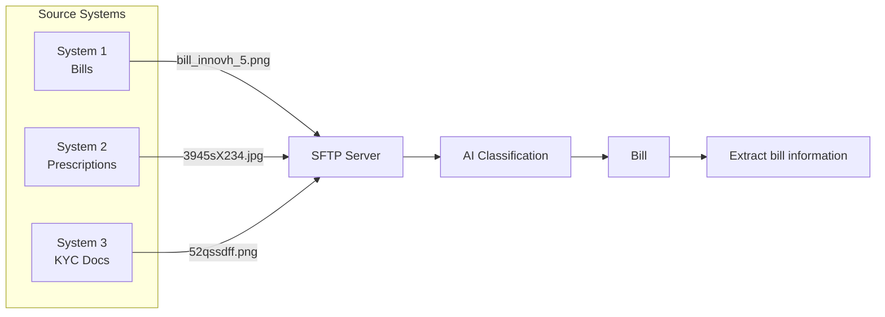

# MediShield AI-Powered Document Classification

This project aims to automate the classification of scanned document images for MediShield Insurance using Google Gemini's multimodal capabilities.

## Overview
MediShield receives thousands of scanned images (prescriptions, bills, claim forms, KYC) monthly. This tool automates the routing of these documents to the correct processing queues.

## Key Features
- **Multimodal Classification**: Uses Gemini API to identify document types from visual and text data.
- **Categorization**: Routes documents into:
  - Patient Bills
  - Claim Forms
  - KYC Documents
  - Medical Reports
  - Prescriptions
  - Unknown
- **Performance Focused**: Target accuracy of >= 95% and processing time < 5s.

## Architecture
The classification system operates using a multi-stage pipeline as visualized below. Documents are ingested from various source systems via SFTP, then processed by the AI Classification module, with specific downstream pipelines (e.g., information extraction for bills).



## Getting Started
1. **Setup Environment**:
   ```bash
   uv sync
   ```
2. **Configure API Key**:
   Create a `.env` file and add your `GOOGLE_API_KEY`.
3. **Run Pipeline**:
   ```bash
   python src/main.py --dataset dataset --output classification_results.csv
   ```

## Tasks & Progress
The detailed implementation plan can be found in the [tasks.md](file:///C:/Users/sans/.gemini/antigravity/brain/edc3de68-cd4e-4efc-9f15-67986e377aab/tasks.md) artifact.
