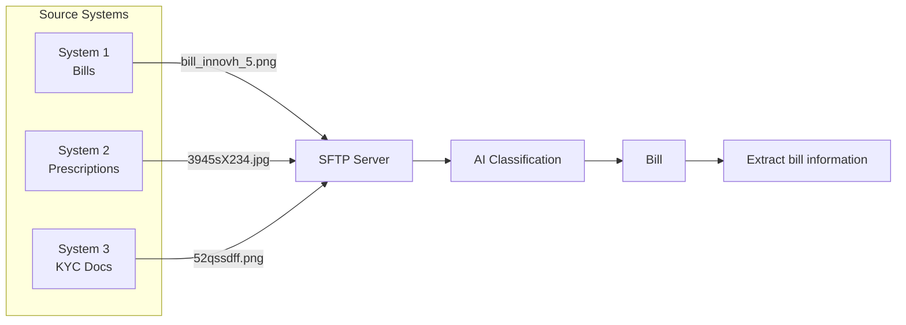

# MediShield AI-Powered Document Classification

This project aims to automate the classification of scanned document images for MediShield Insurance using Google Gemini's multimodal capabilities.

## Overview
MediShield receives thousands of scanned images (prescriptions, bills, claim forms, KYC) monthly. This tool automates the routing of these documents to the correct processing queues.

## Key Features
- **Multimodal Classification**: Uses Gemini API to identify document types from visual and text data.
- **Categorization**: Routes documents into:
  - Patient Bills
  - Claim Forms
  - KYC Documents
  - Medical Reports
  - Prescriptions
  - Unknown
- **Performance Focused**: Target accuracy of >= 95% and processing time < 5s.

## Architecture
The classification system operates using a multi-stage pipeline as visualized below. Documents are ingested from various source systems via SFTP, then processed by the AI Classification module, with specific downstream pipelines (e.g., information extraction for bills).



## Getting Started
1. **Setup Environment**:
   ```bash
   uv sync
   ```
2. **Configure API Key**:
   Create a `.env` file based on `.env.example`:
   ```bash
   cp .env.example .env
   # Edit .env and add your GOOGLE_API_KEY
   ```
3. **Run Pipeline**:
   ```bash
   python src/main.py --dataset dataset --output classification_results.csv
   ```

## Production Deployment

### Docker Deployment
The application is containerized and ready for production deployment:

```bash
# Build the Docker image
docker build -t medishield-classifier:latest .

# Run with Docker Compose (recommended)
docker-compose up -d
```

The application will be accessible at `http://localhost:8000`

### Environment Configuration
For production, set the following environment variables:
- `GOOGLE_API_KEY`: Your Gemini API key (required)
- `ENV`: Set to `production`
- `PORT`: Server port (default: 8000)
- `LOG_LEVEL`: Logging level (default: INFO)

### Health Check
The application includes a health check endpoint:
```bash
curl http://localhost:8000/health
```

## API Endpoints

### GET `/health`
Returns application health status

**Response:**
```json
{
  "status": "healthy",
  "service": "MediShield Document Classifier"
}
```

### GET `/`
Serves the web UI for document classification

### POST `/classify`
Classify a document image

**Request:**
- Content-Type: multipart/form-data
- File: Document image (JPEG, PNG, GIF, WebP)
- Max file size: 10MB

**Response:**
```json
{
  "filename": "document.jpg",
  "category": "Patient Bills",
  "method": "llm"
}
```

**Error Responses:**
- 400: Invalid file type or filename
- 413: File size exceeds 10MB
- 500: Classification error

## Tasks & Progress
The detailed implementation progress is tracked via the project roadmap. See [RESOURCES.md](RESOURCES.md) for more details.
